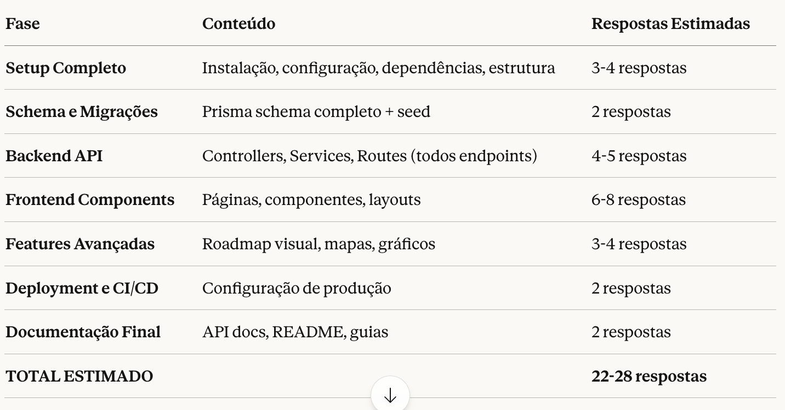

# 📊 Tokens e Respostas Estimadas

Contexto atual:

Limite por resposta: ~8.000 tokens (aproximadamente)
Já consumimos: ~2 respostas completas
Escopo total do projeto: Sprint 1 a Sprint 8 (16 semanas de desenvolvimento)

Estimativa de respostas necessárias para documentação completa:

Tempo real estimado:
Com pausas + revisões + seus comandos "CONTINUAR": ~3-4 horas de interação
Desenvolvimento real (você codando): 16 semanas (seguindo os sprints)